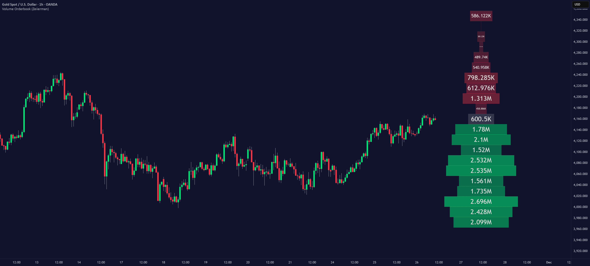

# Multi Order Book Matching Engine

[](https://github.com/Turbo673/Orderbook/actions/workflows/ci.yml)
[](LICENSE)
[](https://github.com/Turbo673/Orderbook/releases)
[]()
[]()



A C++ matching engine that implements price time priority, multiple order types, and real time trades

---

## What is Multi Order Book Matching Engine

A C++ matching engine that implements price time priority, multiple order types, and real time trades

---

## Demo (TypeScript + React)

* Nasdaq-style NVDA order-book demo
* Best bid/ask updates
* NVDA trade updates

Run the visualizer:

```powershell
cd C:\Users\User\Orderbook\Demo
npm install
npm run build
npm run dev
```

```cmd
cd C:\Users\User\Orderbook\Demo
npm install
npm run build
npm run dev
```

The current UI uses a TypeScript/React simulation and is not connected to
the C++ engine. This is a demo for people to understand how FOC, IOC, and other order types work. Its typed snapshot and trade-event boundary is intended to
be replaced by an HTTP or WebSocket adapter over the C++ engine.

---

## Installation

Clone the repository:

```bash
git clone https://github.com/Turbo673/Orderbook.git
cd Orderbook
```

Run the Engine:

```cmd
make
```

---

## Usage

Run the Engine:

```cmd
make
```

Run the Doctest:

Run the Engine:

```cmd
make test
```

---

## Features

* Price time matching
* Limit, Market, Cancel and Modify orders
* Partial fills
* Immediate or Cancel (IOC) and Fill or Kill (FOK)
* Execution report generation
* CSV order processing
* Benchmark testing via doctest

---

## Configuration

The current UI uses a TypeScript/React simulation and is not connected to
the C++ engine. This is a demo for people to understand how FOC, IOC, and other order types work. Its typed snapshot and trade-event boundary is intended to
be replaced by an HTTP or WebSocket adapter over the C++ engine.

---

## System Design

There will a link to the system design document: [System Design](https://github.com/)

---

## Data Structures

* unordered_map for looking up, cancel/modify, and for fast efficency O(1)
* FIFO queues provides priority at each price level
* Price levels groups orders by price for efficient mathing

---

## Algorithm/Logic for Matching

* Buy orders match against lowest sell prices
* Sell orders match agianst highes

---

## Documentation

* System Design: [System Design](https://github.com/)
* Demo: TypeScript + React visualizer
* Tests: Doctest

---

## Community

Contributions, issues, and feedback are welcome.

---

## Credits

* Coding Jesus [Youtube](https://www.youtube.com/watch?v=XeLWe0Cx_Lg)\ , [Github]()

---

## License

MIT License.
